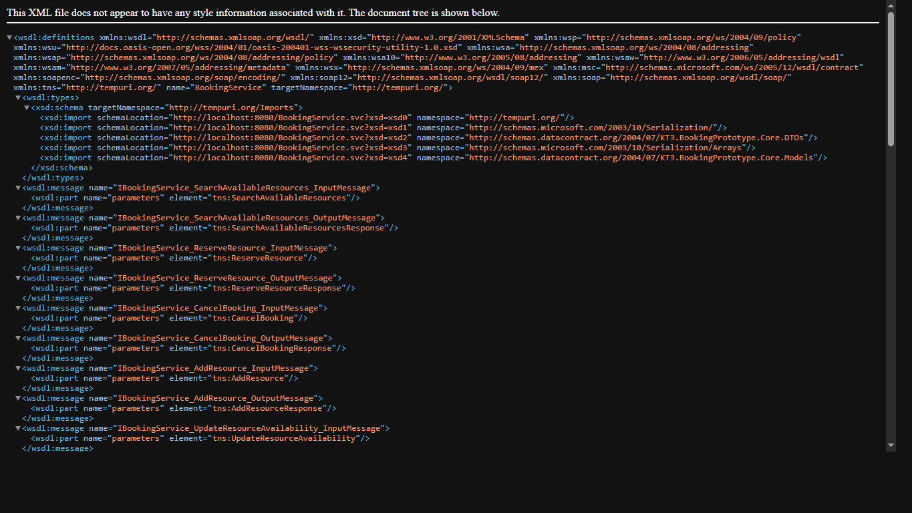
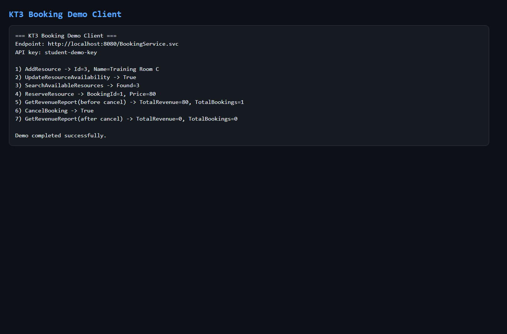

# KT3.BookingPrototype

Минимальный рабочий прототип CoreWCF-сервиса для задания "Система бронирования".

## Формат сдачи

- Прототип сервиса - работающий код (ссылка на GitHub): `https://github.com/maximb2222/aspNet_kt3/tree/kt3-booking-prototype`
- Заполненный README: этот файл.
- Скриншоты работающих сервисов (браузер, консоль клиента): добавлены ниже и в `docs/screenshots`.

## Что реализовано

- Базовая бизнес-логика бронирования ресурсов.
- Минимальный набор операций (6 шт.):
- `SearchAvailableResources`
- `ReserveResource`
- `CancelBooking`
- `AddResource`
- `UpdateResourceAvailability`
- `GetRevenueReport`
- Простая аутентификация: SOAP-заголовок `X-Api-Key`.
- Документированные контракты/модели/DTO в `Core`.
- Тестовый консольный клиент для демонстрации.
- Сложные типы данных: `Schedule`, `TimeSlot`, `RevenueReport`, `ResourceRevenueItem`, `CustomerInfo`.

## Структура

```text
KT3.BookingPrototype/
├─ src/
│  ├─ KT3.BookingPrototype.Core/
│  │  ├─ Contracts/
│  │  ├─ Models/
│  │  └─ DTOs/
│  ├─ KT3.BookingPrototype.Service/
│  │  ├─ Services/
│  │  ├─ Repositories/
│  │  └─ Program.cs
│  └─ KT3.BookingPrototype.Client/
│     └─ Program.cs
├─ docs/
│  └─ screenshots/
├─ .gitignore
├─ README.md
└─ KT3.BookingPrototype.sln
```

## Быстрый запуск

Из корня проекта:

1. Запусти сервис:

```bash
dotnet run --project .\src\KT3.BookingPrototype.Service
```

2. Во втором окне запусти клиента:

```bash
dotnet run --project .\src\KT3.BookingPrototype.Client
```

## Скриншоты

### Браузер (WSDL)



### Консоль клиента



## Demo auth

- Header name: `X-Api-Key`
- Header namespace: `urn:kt3:auth`
- Demo key: `student-demo-key`

